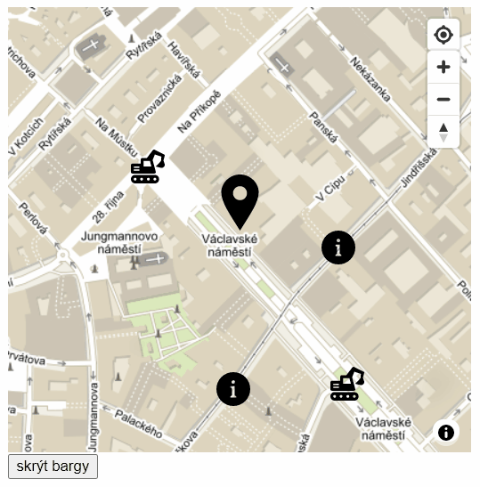

# Cvičení: React mapy

Dokumentace react-map-gl: https://visgl.github.io/react-map-gl/docs/get-started/get-started



## Zadání

1. Vycházej z kódu [React starter](https://github.com/Czechitas-podklady-WEB/project-starter).

1. Založ si účet na [mapbox.com](https://www.mapbox.com/).

1. Po registraci se dostaneš na stránku s [přehledem tvého účtu](https://account.mapbox.com/). V levé dolní části uvidíš box `Access tokens` a šedý rámeček s `Default public token`. V pozdějším kroku ho budeš potřebovat.

1. Nainstaluj závislost pro mapy.

   1. Spusť `npm install react-map-gl`.
   1. Závislost vyžaduje drobnou úpravu ve `webpack.config.js`. Pod řádek s `test: /\.jsx?$/,` přidej `exclude: /node_modules/,`.
   1. A před řádek `module: {` přidej `devtool: "source-map",`.
   1. Pokud máš puštěný vývojový server (`npm start`), ukonči ho a pusť znovu. Změna v konfiguračním souboru se jinak neprojeví.

1. Vytvoř v `src` složku `components` a v ní přichystej komponentu `Mapa`.

   ```jsx
   import React from 'react'

   export const Mapa = () => {
   	return <>Mapa</>
   }
   ```

1. Přidej mapu na stránku.

1. Koukni do prohlížeče a zkontroluj, že se ti na stránce vypisuje text `Mapa`.

1. Mapbox vyžaduje import vlastních css. Přidej do komponenty `import 'mapbox-gl/dist/mapbox-gl.css'`.

1. Zobraz základní mapu.

   1. Přidej do komponenty stav, který bude reprezentovat střed mapy a přiblížení. Nezapomeň `useState` importovat.

      ```js
      const [viewport, setViewport] = useState({
      	latitude: 50.082627979423236,
      	longitude: 14.426295971100695,
      	zoom: 15,
      })
      ```

   1. Naimportuj `ReactMapGl` pomocí `import ReactMapGL from 'react-map-gl'`.

   1. Komponentu `ReactMapGl` vykresli.

      ```jsx
      return (
      	<ReactMapGL
      		{...viewport}
      		width="100%"
      		height={400}
      		onViewportChange={(nextViewport) => setViewport(nextViewport)}
      		mapboxApiAccessToken="pk...."
      	></ReactMapGL>
      )
      ```

   1. Do vlastnosti `mapboxApiAccessToken` dosaď tvůj `Default public token` z [account.mapbox.com](https://account.mapbox.com/).

   1. Vyzkoušej, že se ti mapa zobrazí a ukazuje Václavské náměstí.

1. Vyzkoušej různé styly mapových podkladů.

   1. Na adrese s dokumentací Mapboxu [docs.mapbox.com/api/maps](https://docs.mapbox.com/api/maps/#mapbox-styles) si prohlídni ukázky různých předpřipravených stylů a jeden si vyber.

   1. Vybraný styl aplikuj na tvou mapu. Třeba takto:

      ```
      mapStyle="mapbox://styles/mapbox/outdoors-v11"
      ```

1. Přidej na mapu Marker, který bude značit polohu Czechitas na Václavském náměstí.

   1. Z webu [iconmonstr.com](https://iconmonstr.com/location-1-svg/) stáhni ikonku špendlíku a ulož ji do složky `src/images` pod názvem `spendlik.svg`.

   1. Z webu [gps-coordinates.net](https://www.gps-coordinates.net/) zjisti souřadnice `latitude` a `longitude` (zeměpisnou šířku a délku). Adresu zjistíš třeba ze stránek [czechitas.cz](https://www.czechitas.cz/cs/kontakt). V sekci `Kontakt` je to `Korespondenční adresa Praha`. Na [gps-coordinates.net](https://www.gps-coordinates.net/) dávej pozor na to, že v Čr není jen jedno Václavské náměstí.

   1. Přidej do komponenty `Mapa` import Markeru.

      ```js
      import ReactMapGL, { Marker } from 'react-map-gl'
      ```

   1. Marker přidej jako potomka `<ReactMapGL>`. Nastav mu vlastnosti `latitude` a `longitude`. Použij hodnoty z [gps-coordinates.net](https://www.gps-coordinates.net/).

      ```
      <Marker latitude={…} longitude={…}>
      	Czechitas
      </Marker>
      ```

   1. Místo textu `Czechitas` vlož do Markeru obrázek špendlíku.

      ```js
      import spendlikUrl from '../images/spendlik.svg'
      ```

      ```
      
      ```

   1. Všimni si, že špendlík je zapíchnutý o kousek vedle a jeho poloha se při přibližování a oddalování mapy (třeba kolečkem myši) lehce mění. Je to tím, že Mapbox neví, kde má ikonka hrot. Nastav Markeru vlastnosti `offsetLeft` a `offsetTop`. `offsetLeft={-25}` říká, že hrot je po ose x posunutý o `25` pixelů od levého horního rohu. `offsetTop={-50}` pak o `50` pixelů po ose y. Zkontroluj, že se špendlík už drží na správném místě.

1. Označ Marker Popupem.

   1. Přidej do importů `{ Popup }` z `react-map-gl`.

   1. Přidej Popup bublinu vedle Markeru.

      ```
      <Marker …>…</Marker>
      <Popup
      	latitude={50.0833715}
      	longitude={14.4252452}
      >
      	Czechitas
      </Popup>
      ```

   1. Popup má také vlastnost `offsetTop`. Nastav ji tak, aby bublina nepřekrývala špendlík, byla nad ním.

1. Zobraz Popup až po kliknutí na Marker.

   1. Přidej stavovou proměnnou.

      ```js
      const [popupOtevren, setPopupOtevren] = useState(false)
      ```

   1. Vykresli Popup jen v případě, že `popupOtevren` je `true`.

      ```jsx
      {popupOtevren && <Popup … />}
      ```

   1. Obal obrázek v Markeru tlačítkem, které na klik upraví stav.

      ```
      <button onClick={() => setPopupOtevren(true)}></button>
      ```

   1. Vyzkoušej, že kliknutí opravdu otevírá Popup.

   1. Po kliknutí na křížek v pravém horním rohu Popup zavři. Přidej Popupu posluchač `onClose`.

      ```
      <Popup
      …
      onClose={() => setPopupOtevren(false)}
      >
      ```

   1. Vyzkoušej.

   1. Dostyluj `button` v Markeru, aby byl nenápadný.

      1. Dej mu `className="marker-button"`.

      1. Vytvoř v `components` soubor `marker-button.css` a naimportuj ho.

      1. Přidej do něj styly.

         ```css
         .marker-button {
         	padding: 0;
         	border: none;
         	background-color: transparent;
         	display: flex;
         	outline: none;
         	cursor: pointer;
         }
         ```

1. Zobraz na mapě více Markerů.

   1. Přidej do složky `src/images` obrázek [bagru](https://iconmonstr.com/construction-4-svg/) jako `bagr.svg` a [informační ikonky](https://iconmonstr.com/info-5-svg/) jako `info.svg`.

   1. Importuj je v komponentě `Mapa`.

      ```js
      import bagrUrl from '../images/bagr.svg'
      import infoUrl from '../images/info.svg'
      ```

   1. Přichystej si na začátku komponenty pole objektů.

      ```js
      const mista = [
      	{
      		id: 1,
      		ikonaUrl: bagrUrl,
      		latitude: 50.08415631476569,
      		longitude: 14.423472469019359,
      	},
      	{
      		id: 2,
      		ikonaUrl: infoUrl,
      		latitude: 50.08140252219053,
      		longitude: 14.425123690476866,
      	},
      	{
      		id: 3,
      		ikonaUrl: infoUrl,
      		latitude: 50.08315119880879,
      		longitude: 14.42713937555392,
      	},
      	{
      		id: 4,
      		ikonaUrl: bagrUrl,
      		latitude: 50.08147136893371,
      		longitude: 14.427310912961879,
      	},
      ]
      ```

   1. Představme si, že třeba ikonky bargu budou symbolizovat neprůchodná místa, kde se zrovna staví a ikonky informací budou místa s info stánky.

   1. Pomocí `mista.map` vykresli všechny nové špendlíky na mapě.

      ```
      {mista.map((misto) => (
      	<Marker
      		key={misto.id}
      		latitude={misto.latitude}
      		longitude={misto.longitude}
      		offsetLeft={-15}
      		offsetTop={-15}
      	>
      		
      	</Marker>
      ))}
      ```

1. Přidej filtrování pro zvýraznění informačních stánků, skrytí bagrů.

   1. Přidej stavovou proměnnou.

      ```js
      const [bargrySkryty, setBargrySkryty] = useState(false)
      ```

   1. Pod `</ReactMapGL>` přidej tlačítko, které bude měnit (togglovat) stav `bargrySkryty` z `false` na `true` a obráceně. Return může vracet jen jeden prvek. Budeš muset `<ReactMapGL>` a `<button>` obalit React fragmentem `return <>…</>`.

      ```
      <button onClick={() => setBargrySkryty(!bargrySkryty)}>
      	{bargrySkryty ? 'zobrazit' : 'skrýt'} bargy
      </button>
      ```

   1. K výpisu `mista` přidej filtr, který bude skrývat bagry.

      ```js
      mista
      	.filter((misto) => bargrySkryty === false || misto.ikonaUrl !== bagrUrl)
      	.map(…)
      ```

1. Přidej na stránku tlačítka pro ovládání přiblížení.

   1. Importuj `{ NavigationControl }` z `react-map-gl`.

   1. Mezi potomky `<ReactMapGL>` přidej `div` a v něm `NavigationControl`.

      ```
      <div className="ovladani">
      	<NavigationControl />
      </div>
      ```

   1. Všimni si třídy `ovladani`. Vytvoř soubor `ovladani.css`, importuj ho a napiš do něj styly pro ovládací panel.

      ```css
      .ovladani {
      	position: absolute;
      	top: 10px;
      	right: 10px;
      }
      ```

1. Přidej tlačítko pro zaměření aktuální polohy uživatele.

   1. Importuj `{ GeolocateControl }` z `react-map-gl`.

   1. Vedle vykreslení `<NavigationControl />` přidej `<GeolocateControl />`.

   1. Vyzkoušej, co tlačítko po kliknutí dělá. Poprvé by se tě mělo zeptat na přístup k polozek a po chvíli pak zaměřit mapu na místo, kde zrovna jsi. Na počítači může být poloha značně nepřesná.

## Bonus

1. Navrhni a použij vlastní styl podkladové mapy pomocí [studio.mapbox.com](https://studio.mapbox.com/).

1. Umožni uživateli přesouvat Marker kliknutím na mapu.

   1. Stáhni si obrázek [kotvy](https://iconmonstr.com/anchor-7-svg/) a ulož ho do složky `src/images` s názvem `kotva.svg`.

   1. Přidej do komponenty `Mapa` stav, který bude reprezentovat polohu kotvy.

      ```js
      const [polohaKotvy, setPolohaKotvy] = useState({
      	latitude: 50.082027979423236,
      	longitude: 14.426295971100695,
      })
      ```

   1. Vykresli do mapy nový Marker s ikonou kotvy a polohou podle stavu `polohaKotvy`.

      ```
      <Marker {...polohaKotvy} offsetLeft={-25} offsetTop={-50}>
      	
      </Marker>
      ```

   1. Do `<ReactMapGL>` přidej poslichač události `onClick`, který bude přenastavovat stav `polohaKotvy`. Všimni si, že událost (`event`) má vlastnost `event.lngLat`, pole o dvou prvcích v pořadí `longitude`, `latitude`.

      ```
      onClick={(event) =>
      	setPolohaKotvy({
      		latitude: event.lngLat[1],
      		longitude: event.lngLat[0],
      	})
      }
      ```

1. Umožni uživateli přesouvat kotvu tahem myši.

   1. Protože obrázky mají na tah myši speciální chování, budeš ho muset potlačit stylem `pointer-events: none`. Ideálně by takový styl mohl být ve vlastním souboru `css`, ale pro teď si práci můžeš zjednodušit inline stylováním přímo v `jsx`.

      ```
      
      ```

   1. Nastav Markeru s kotvou vlastnou `draggable`.

      ```
      <Marker … draggable>
      ```

   1. Vyzkoušej si kotvu tahem myši na mapě přemístit. Všimni si, že po puštění tlačítka Marker vždy skočí do původní polohy.

   1. Na událost `onDragEnd` ulož do `polohaKotvy` nové umístění.

      ```
      <Marker
      	…
      	draggable
      	onDragEnd={(event) =>
      		setPolohaKotvy({
      			latitude: event.lngLat[1],
      			longitude: event.lngLat[0],
      		})
      	}
      >
      ```

   1. Nyní by kotva po přesunutí tahem myši měla zůstat na novém místě. Vyzkoušej si to. Hodnotu `polohaKotvy` můžeš na nějakém projektu případně využít pro zadávání polohy uživatelem při ukládání formuláře s mapou.
